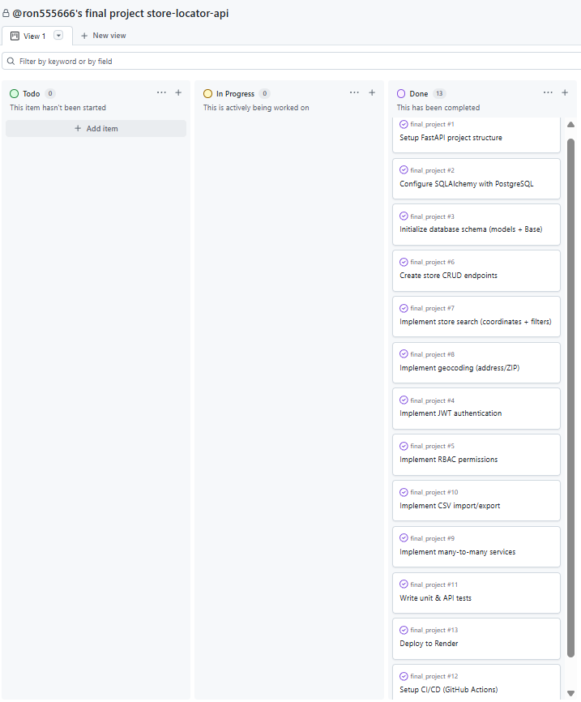

# Store Locator API

A backend service for searching and managing store locations, built with FastAPI.

---

## Project Description

This project provides a RESTful API for managing and searching store locations.  
It supports location-based search, filtering, authentication, role-based access control (RBAC), reviews, and CSV import/export.

The system is designed to simulate a real-world backend service with emphasis on API design, data modeling, and access control.

---

## Features

### Store Search

- Search by:
  - Coordinates (latitude / longitude)
  - Address
  - ZIP code
- Filters:
  - Radius
  - Store types
  - Services (many-to-many)
  - Open now
  - Minimum rating

---

### Store Management

- Create, update, and delete stores
- Partial update (PATCH)
- Many-to-many relationship with services

---

### Authentication and RBAC

- JWT-based authentication
- Roles:
  - Admin
  - Marketer
  - Viewer
- Permissions:
  - Admin: full access
  - Marketer: manage stores
  - Viewer: read-only access

---

### Reviews

- Add reviews to stores
- Calculate average rating
- Flag inappropriate reviews

---

### Import / Export

- CSV import for bulk store creation
- Validation and error reporting
- CSV export of store data

---

### Additional Features

- Rate limiting
- Geocoding integration
- Error handling for edge cases

---

## Tech Stack

- FastAPI (API framework)
- SQLAlchemy (ORM)
- Pydantic (data validation and serialization)
- PostgreSQL (production database)
- SQLite (testing database)
- In-memory cache (for geocoding results)
- Pytest (testing)
- GitHub Actions (CI)

---

## Framework Choice

FastAPI was chosen because it provides:

- High performance with async support
- Built-in request validation using Pydantic
- Automatic interactive API documentation (Swagger UI)
- Clean and concise syntax for building REST APIs

---

## CSV Processing

The built-in Python `csv` module is used for CSV import.

Reasons:

- Lightweight and sufficient for this use case
- No need for heavy dependency like pandas
- Easier validation and row-by-row error handling

---

## Setup Instructions

```bash

1. Install dependencies
pip install -r requirements.txt

2. Configure environment variables
Create a .env file based on .env.example:

DATABASE_URL=your_database_url
SECRET_KEY=your_secret_key

3. Initialize database
python seed_rbac.py
python seed_users.py
Run Locally
uvicorn app.main:app --reload

API base URL:

http://127.0.0.1:8000

Swagger documentation:

http://127.0.0.1:8000/docs
Testing

Run tests locally:

$env:DATABASE_URL="sqlite:///./test.db"
$env:SECRET_KEY="test-secret-key"
$env:PYTHONPATH="."
pytest --cov=app
CI/CD

CI is configured using GitHub Actions:

Runs tests on every push
Includes coverage reporting
API Endpoints
Authentication
POST /api/auth/login
POST /api/auth/refresh
POST /api/auth/logout

Admin Users
POST /api/admin/users/
GET /api/admin/users/
PUT /api/admin/users/{user_id}
DELETE /api/admin/users/{user_id}

Admin Stores
POST /api/admin/stores/
GET /api/admin/stores/
GET /api/admin/stores/{store_id}
PATCH /api/admin/stores/{store_id}
DELETE /api/admin/stores/{store_id}

Store Search
POST /api/stores/search

Reviews
POST /api/stores/{store_id}/reviews
GET /api/stores/{store_id}/reviews
GET /api/stores/{store_id}/rating
PATCH /api/stores/reviews/{review_id}/flag

CSV Import / Export
POST /api/admin/stores/import
GET /api/admin/stores/export/csv

Full API documentation is available at:

http://127.0.0.1:8000/docs
Authentication Flow
User logs in via /api/auth/login
Server returns a JWT access token
Client sends the token in the Authorization header:
Authorization: Bearer <access_token>
Protected endpoints validate the token and check permissions
Distance Calculation

Store search uses a two-step approach:

Bounding box filtering using latitude and longitude
Exact distance calculation using geodesic distance (via geopy)

This improves performance by reducing the number of distance calculations.

Database Schema

Main tables:

stores
services
store_services (many-to-many)
users
roles
permissions
role_permissions
reviews
refresh_tokens

Stores and services use a many-to-many relationship through store_services.

Architecture Overview
FastAPI handles routing and request lifecycle
Pydantic handles validation and serialization
SQLAlchemy handles database interaction
RBAC middleware enforces permissions
Geocoding integrates external API with in-memory caching
Sample API Request and Response
Create Store

Request:

{
  "store_id": "DEMO001",
  "name": "Demo Store",
  "store_type": "regular",
  "status": "active",
  "services": ["pharmacy", "pickup"]
}

Response:

{
  "store_id": "DEMO001",
  "name": "Demo Store",
  "services": "pharmacy|pickup"
}
Deployment

Deployed on Render:

https://your-api-url.onrender.com

Demo credentials:

Admin:

email: admin@test.com
password: AdminTest123!

Viewer:

email: viewer@test.com
password: ViewerTest123!


Database Migration

Database tables are created using SQLAlchemy:

Base.metadata.create_all(bind=engine)
```

## Project Management

This project was organized using a Kanban-style workflow in GitHub Projects.

Tasks were broken down into feature-based units, each corresponding to specific API endpoints and backend logic:

- Authentication (login, refresh, logout endpoints)
- RBAC and permission middleware
- Store CRUD APIs (create, update, delete, list)
- Store search API (coordinates, address, ZIP)
- Search filtering (radius, services, store types, open_now, rating)
- Geocoding integration with caching
- Review system APIs (create review, list reviews, rating summary, flag review)
- CSV import/export APIs with validation
- Unit, API, and integration testing
- CI/CD and deployment

Each task represents a functional unit that can be independently implemented and tested.

Kanban board:
https://github.com/users/ron555666/projects/3

### Kanban Board Snapshot


